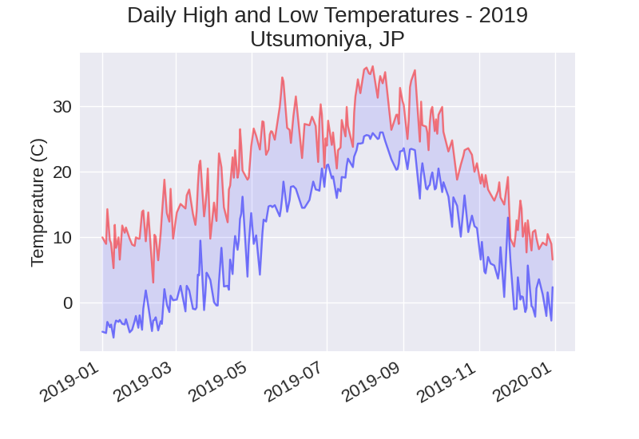

Of note in this directory is [utsu_temps_2019.py](utsu_temps_2019.py). Using what I learned in this chapter, I requested 2019's temperature data in csv format from a weather service for a local city. I used that data to create a simple graph of high and low temperatures in 2019 using matplotlib.

