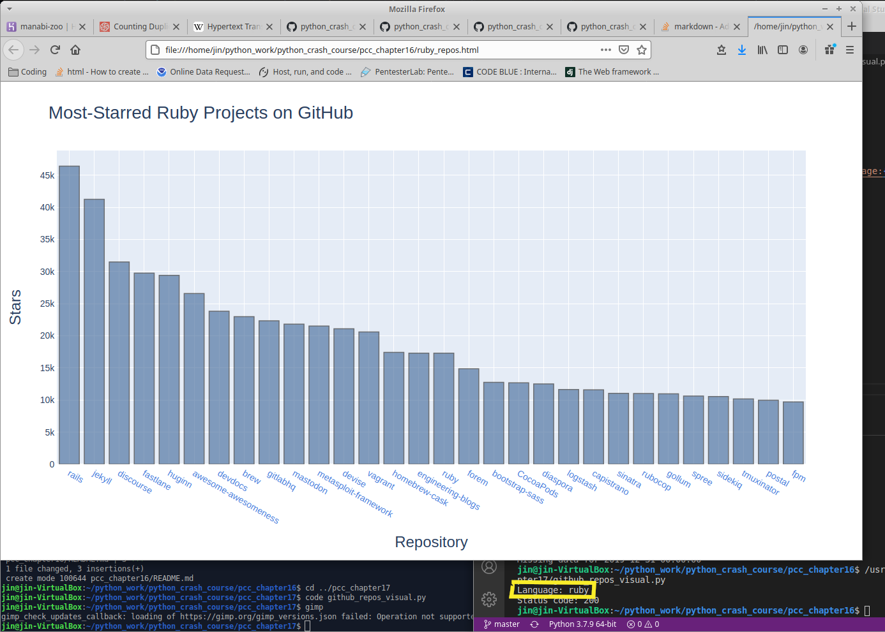

Notable work in this chapter is [github_repos_visual.py](github_repos_visuals.py). I took what I learned about pulling information from APIs and made a program that asks for a language and returns a visual of the most starred GitHub repos for that language. The repo names are also active links to the actual repo.

The visualization is made using the Plotly library.

