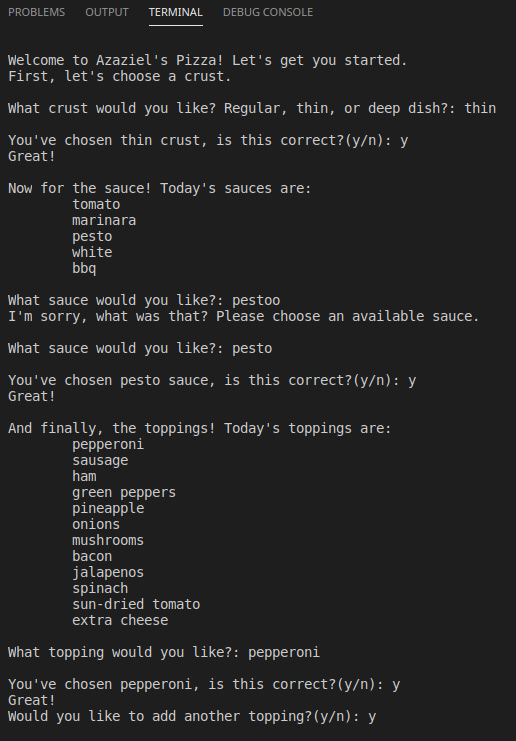
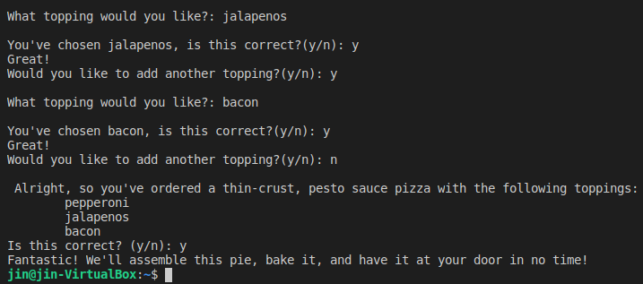

Chapter 6 is all about dictionaries. Creating them, stuffing lists in them, the works.

This is about the point where the dopamine rush of EVERYTHING IS NEW AND I'M PROGRESSING
AT LIGHTSPEED began to wear off. Curiously, this is also when I realized this is the path
I should be on because despite that change it still felt good to work with code and do
the things I was and am doing.

For the most part I didn't stray too far from the prescribed code save for one notable
  exception:
  
  pizza.py
  
I used that sample code for the final Try It Yourself exercise of the chapter. The goal
  was to use what I had learned so far to build on code previously encountered in the
  book. So I took my (still untaught by the book) input and while and built.
  
  The result took thirteen lines of code that summarized a pizza order and turned it into
  taking a user's actual pizza order from crust type to final toppings and summarizing -that-.
  

At the time of writing, this is the accomplishment I'm most proud of.
Though that will probably change once I get to the projects section of the book.
