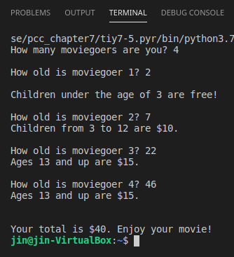

Chapter 7 covers while and input(), finally.

Since I had already taught myself while and input ahead of time, I breezed through
  this chapter. But don't take that to mean I didn't learn anything. I was unaware
  of break, and now it's part of my repertoire. I also learned that while operates
  Boolean values, meaning that setting while True will run until break, and while
  (variable that's set equal to True) will run until that flag is False.
  
This is also the chapter when things really began to click, and I was able to
  produce code when asked without having to flip to prior pages/chapters.
  
Notable programs from this chapter include tiy7-5.py, where I was tasked with
  printing ticket prices according to age. I took it a step further and totaled
  those prices and announced the final price at the end.
  
 
