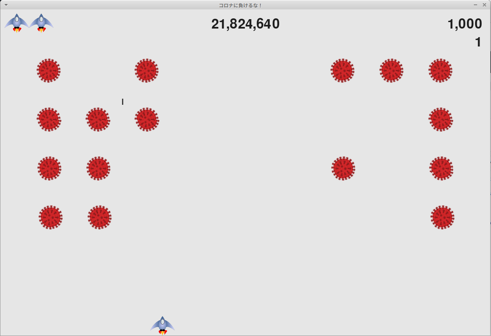

In コロナに負けるな！(Don't Lose to Covid!), the player controls a rocket ship that appears at the bottom center of the screen. The player can move the ship right and left using the arrow keys and shoot bullets using the spacebar. When the game begins, a fleet of covid viruses fills the screen and moves across and down the screen. The player shoots and destroys the viruses. If the player shoots all the viruses, a new fleet appears that moves faster than the previous fleet. If any virus hits the player's ship or reaches the bottom of the screen, the player loses a ship. If the player loses three ships, the game ends.

In my version of this book project, I changed the book's alien to the covid-19 virus to work out some stress over certain world events. I also decided to make the ship and bullet speed static while covid speed increases every level. High score is also retained between instances locally and updated live during play. I also made the game startable with spacebar (which is also tied to fire but does not restart the game when you fire) because having to take my hand off the keyboard to click the start button every new game got annoying.

Game is built with Python using the Pygame library.

