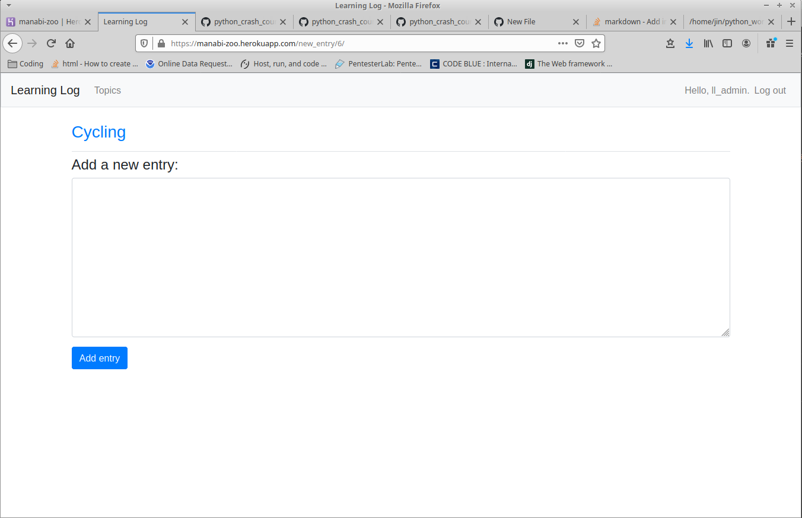

As the final project of Python Crash Course, this was by far the most involved. I learned how to set up and work within a virtual environment, install packages to the VM, and run a local server to test app development locally. I also learned how to push a git subdirectory, as this app is a subdirectory within my overall PCC repo. The app utilizes Python, Django, Bootstrap4, and a touch of HTML, and is deployed using Heroku. You can interact with the live app by [clicking here](https://manabi-zoo.herokuapp.com/).

Overall, I feel I learned the most with the development of this app. I encountered many issues due to version differences with the book, not having the root of my git repo in the root of the app, and so on. But I treated them as opportunities to learn more than the book provided and I feel I've become a stronger programmer for it. From here, when I have the time, I plan to change the color scheme from the default bootstrap colors, add public topics and the ability to toggle topics between public and private, and add Japanese functionality. All of those will take more learning, and I'm eager to dig in as I continue my development as a programmer.

Splash Page
![splash page](splash_page.png]

Registration Page

Login Page

Topics Page

New Topic Page

Topic Page

New Entry Page

Edit Entry Page

